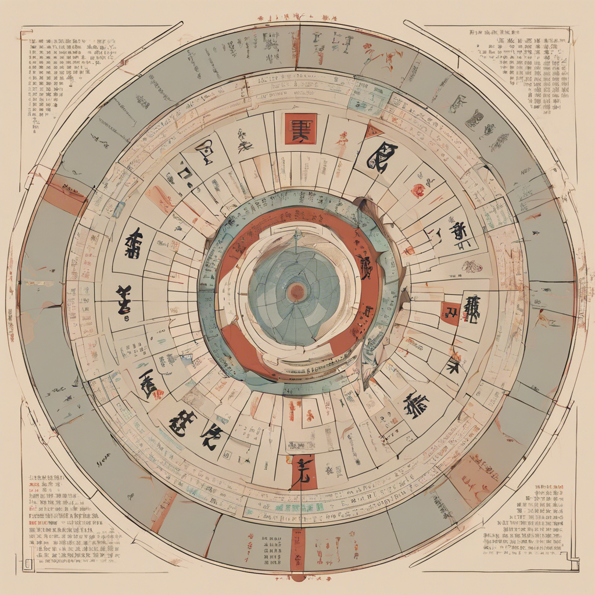

# 神算机 (The Augury Machine)

这是一个基于大语言模型的八字算命项目，支持多个LLM模型（智谱AI、DeepSeek、Qwen等）来进行算命分析。

## 功能特点

- 支持用户输入生日信息，自动转换为天干地支
- 集成多个大语言模型API，提供全面的命理分析
- 简洁直观的Gradio用户界面
- 详细的命理分析结果展示

## 安装使用

1. 克隆项目
```bash
git clone https://github.com/Ambier/llm-fortune-telling.git
cd llm-fortune-telling
```

2. 安装依赖
```bash
pip install -r requirements.txt
```

3. 配置环境变量
创建 `.env` 文件并添加以下配置：
```
ZHIPUAI_API_KEY=your_zhipuai_key
DASHSCOPE_API_KEY=your_dashscope_key
DEEPSEEK_API_KEY=your_deepseek_key
```

4. 运行应用
```bash
python app.py
```


## 项目结构

```
llm-fortune-telling/
├── app.py              # 主应用入口
├── requirements.txt    # 项目依赖
├── .env               # 环境变量配置
├── README.md          # 项目文档
└── src/
    ├── __init__.py
    ├── bazi/          # 八字相关核心逻辑
    │   ├── __init__.py
    │   ├── calculator.py
    │   └── utils.py
    ├── llm/           # LLM集成相关
    │   ├── __init__.py
    │   ├── zhipu.py
    │   ├── deepseek.py
    │   └── qwen.py
    └── ui/            # Gradio界面相关
        ├── __init__.py
        └── interface.py
```

## 使用说明

1. 在网页界面输入您的出生年月日时间
2. 选择想要使用的LLM模型
3. 点击"开始分析"按钮
4. 等待系统生成详细的命理分析结果

## 贡献指南

欢迎提交Issue和Pull Request来帮助改进项目。

## 许可证

MIT License
